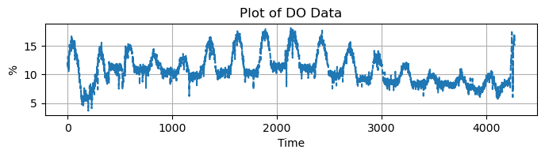
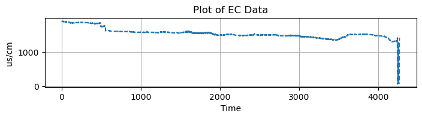
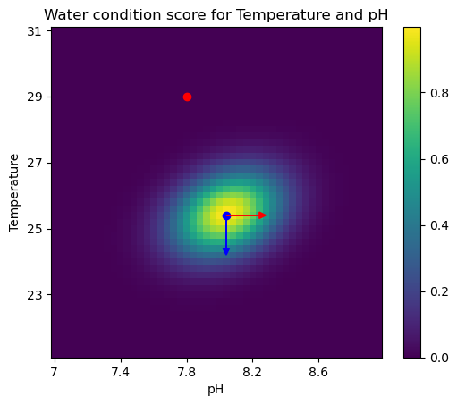

# water_control_algorithm 🦞


### Introduction
Red claw crayfish cultivation is difficult, yet valuable. Suitable water condition of redclaw crayfish is demanding and varies with location <sup>[1][2]</sup>.  

In this repository, I demonstrated water quality control algorithm I designed while working at J & KC limited as machine learning engineer. I used multivariant gaussian function to model the water's condition for red claw crayfish cultivation. I also designed algorithm to produce cultivation suggestions base on output of this function.  
Enjoy!


<insert image to demonstrate my idea>


### Quick start
```
conda env create -f environment.yml
```
Go to `multivariant_gauss_water_quality.ipynb` and everything shall run.  
The notebook is heavily commented for demonstration purpose.


### Preprocessing data
A small chunk of water data (across two weeks) is in `water_data.csv`. They are:

| Name | Unit | Description |
|----------|----------|----------|
| Date | n/a | Date when the data is collected
| Time | n/a | Time when the data is collected
| Temperature | <sup>o </sup>C | Temperature of the water
| pH | pH | Acidity of the water|
| DO | % | Dissolve oxygen in water|
| EC | uS/cm | Electrical conductivity in water|


Lets visualize them:





Obviously, there are some abnormal at the very end of the data, (the EC and temperature dipped rapidly), so I chose to get rid of it and use 0 to 4000 time step of data. I then z-normalized the data. Plotting the cleaned data:


### The model

We are now ready to fit the multivariant gaussian (MVG) model to the water data, more about it [here](https://cs229.stanford.edu/section/gaussians.pdf)<sup>[3]</sup>. Here is the equation for (MVG):


$$ f(x | \mu, \Sigma) = \frac{1}{(2\pi)^{\frac{n}{2}}|\Sigma|^{\frac{1}{2}}}\cdot{}exp(-\frac{1}{2}(x - \mu)^T \Sigma^{-1} (x - \mu)) $$

Where $\Sigma$ is the covariance matrix, $\mu$ is the mean, and $n$ is the dimension of the data, in our case $n = 4$.

To fit the mode using maximum likelyhood fitting, we simply need to calculate the mean and covariance matrix of the water data, and we are done.  
Heres visualization of the model in temperature and pH dimension, with EC and DO at mean value:


Temperature and pH are slightly correlated, which is due to manual control of the crayfish farmer. The blue dot is [temp = 25, pH = 8.5, DO = 11, EC = 1550], which is optimal for cultivation (you can also see in the raw data plot, this is within reasonable range). The red dot is [temp = 20, pH = 8.5, DO = 11, EC = 1550], whcih is too cold for crayfish cultivation.


### Giving Cultivation Suggestion
We can now tell whether the water condition is suitable or not, but we can go further. Here I show how we could use the spirit of greedy algorithm for suggestion. 

I first colelct a set of cultivation activity that the fish farmer would do, e.g:
- Cover the pond when water is too hot
- Turn on oxygen pump if DO is low
- Add enzymes if pH is too low

For each action, model them as a unit vector, pointing towards the direction of its change to water status. For example, the action "covering the pond" would be represented by the vector [-1 0 0 0], meaning that covering the pond would decrease the temperature. Plotting them onto the heatmap:



The red arrow represent action of adding enzymes, and blue arrow represent covering the pond.

Next, we need the gradient of the score function. Differentiationg the MVG expression above gives (noting that covariance matrix is positive semidefinite):

$$ f'(x) = -\Sigma^{-1}\cdot{}x\cdot{}f(x)$$

In practice, we don't need to multiply by f(x), the score of water condition, as we only need the direction of the gradient. Plotting gradient onto the heatmap:

Finally, we can find the inner product similarity of the gradient to each action, and return action with highest similarity as suggestion to user. In this case, the suggestion would be (surprise!) "cover the pond to cool water down", demonstrated in the notebook.


### Discussion
Here are some points for discussion and possible improvements:
- The algorithm auto capture correlations between water quality metrics
- Convenient way to provide cultivation suggestions
- Future work: include positional encoding into time dimension of water data  (e.g. time in the year, in day)
- Future work: Also calculate metric for actions (e.g. covver pond for a period of time, add certain dosage of chemicals to adjust water properties)


### References
[1] https://www.researchgate.net/publication/305239925_Freshwater_Crayfish_Farming_-_a_guide_to_getting_started  
[2] https://www.fao.org/fishery/en/culturedspecies/cherax_quadricarinatus

[3] https://cs229.stanford.edu/section/gaussians.pdf